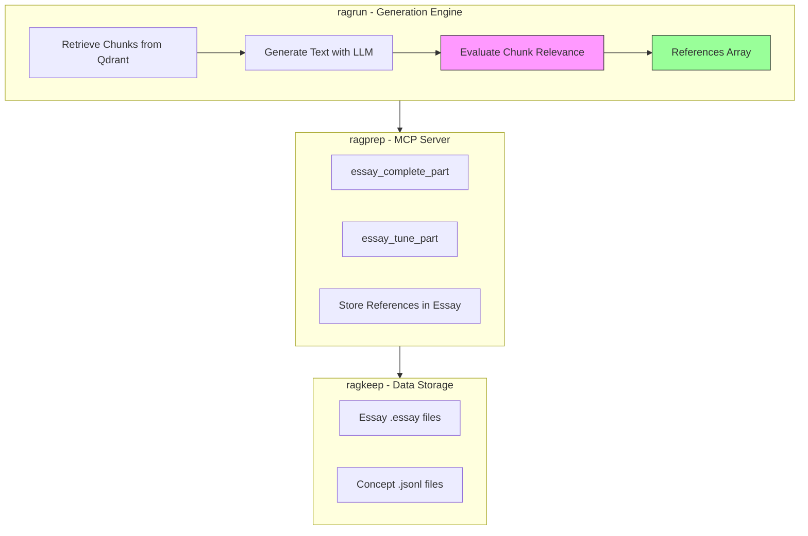

# Chunk Links Implementation Strategy

## Overview

Implement a system to track which chunks were relevant for generating essay parts and concepts. Each reference includes:

- `chunk_id`: Raw identifier (UUID or SHA256 hash)
- `description`: One-line explanation of how the chunk was used
- `relevance`: Float value between 0 and 1

## Architecture




## Phase 1: Data Model Updates

### 1.1 ragrun - Update ChunkMetadata Model

**File**: `[app/shared/models.py](app/shared/models.py)`

Add `references` field to `ChunkMetadata` class (after line 72):

```python
references: Optional[List[Dict[str, Any]]] = Field(
    default=None,
    description="References to chunks that influenced this chunk's generation."
)
```

Each reference dict contains: `chunk_id` (str), `description` (str), `relevance` (float)

### 1.2 ragrun - Postgres Migration

**Create**: `app/db/migrations/versions/0005_add_references_to_chunks.py`

Pattern follows existing migrations (e.g., `0004_add_context_source_to_retrieval_graph_events.py`):

```python
def upgrade() -> None:
    op.add_column(
        "rag_chunks",
        sa.Column("references", sa.JSON(), nullable=True),
    )

def downgrade() -> None:
    op.drop_column("rag_chunks", "references")
```

Note: Use `JSON` type instead of `ARRAY` since references are complex objects.

**File**: `[app/db/tables.py](app/db/tables.py)`

Add to `chunks_table` definition (after line 37):

```python
Column("references", JSONType),
```

### 1.3 ragrun - Mirror Repository Update

**File**: `app/services/mirror_repository.py`

Update `upsert_chunks()` method to include references in row dict (around line 40):

```python
"references": metadata.references or None,
```

### 1.4 ragprep - TypeScript Type Definitions

**File**: `[src/mcp/essayTemplateStore.ts](src/mcp/essayTemplateStore.ts)`

Update type definitions (lines 8-12):

```typescript
type EssayReference = {
    chunk_id: string;
    description: string;
    relevance: number;
};

type EssayTemplatePart = {
    mood?: string;
    header: string;
    text: string;
    references?: EssayReference[];
};
```

### 1.5 ragprep - Update Essay Part Storage

**File**: `[src/mcp/essayTemplateStore.ts](src/mcp/essayTemplateStore.ts)`

Update `updateEssayPart` function (lines 247-289) to accept and store references:

Add parameter to function signature:

```typescript
references?: Array<{chunk_id: string, description: string, relevance: number}>
```

Update the part object before writing:

```typescript
if (references) {
    currentPart.references = references;
}
```

## Phase 2: Reference Evaluation Function

### 2.1 Create Reusable Evaluation Function

**Create**: `app/retrieval/utils/reference_evaluator.py`

```python
async def evaluate_chunk_relevance(
    generated_text: str,
    retrieved_chunks: List[RetrievedSnippet],
    llm: LLM,
    max_chunks: int = 20
) -> List[Dict[str, Any]]:
    """
    Evaluate which retrieved chunks were actually relevant for the generated text.
    
    Returns:
        List of dicts with: chunk_id, description, relevance (0-1 float)
    """
```

Implementation:

1. Build prompt with generated_text and list of chunks
2. Call DeepSeek API with evaluation prompt
3. Parse structured response (JSON)
4. Return references array

### 2.2 Create Evaluation Prompt Template

**Create**: `app/retrieval/prompts/templates/evaluate_chunk_relevance.prompt`

Location: In ragrun repo (local prompts, not assistant-specific)

Template structure:

```
You are evaluating which retrieved chunks were actually used or influenced the generated text.

Generated Text:
{generated_text}

Retrieved Chunks:
{chunks_list}

For each chunk that was relevant, provide:
1. chunk_id
2. One-line description of how it influenced the text
3. Relevance score (0.0-1.0)

Output as JSON array.
```

### 2.3 Integration Points

**File**: `[app/retrieval/graphs/essay_completion.py](app/retrieval/graphs/essay_completion.py)`

Add after header generation (after line 565):

```python
from app.retrieval.utils.reference_evaluator import evaluate_chunk_relevance

# Evaluate relevance
all_retrieved = hits_primary + hits_secondary
references = await evaluate_chunk_relevance(
    generated_text=revised_text,
    retrieved_chunks=all_retrieved,
    llm=llm,
    max_chunks=20
)

# Add to return state
state["references"] = references
```

**File**: `[app/retrieval/graphs/essay_finetune.py](app/retrieval/graphs/essay_finetune.py)`

Same pattern after header generation (after line 343).

### 2.4 Update Graph Response Models

**Files**: 

- `app/retrieval/api/essay_completion.py`
- `app/retrieval/api/essay_tune_part.py`

Add `references` field to response model (if using Pydantic models).

## Phase 3: MCP Server Updates

### 3.1 Update essay_complete_part Handler

**File**: `[src/mcp/essayMcpServer.ts](src/mcp/essayMcpServer.ts)`

Update handler (around lines 256-279):

1. Extract references from API response:

```typescript
const references = response.references || [];
```

1. Pass to updateEssayPart:

```typescript
await updateEssayPart(
    essayPath,
    moodIndex,
    response.revised_header,
    response.revised_text,
    references
);
```

1. Include in MCP response for visibility:

```typescript
return {
    content: [{
        type: "text",
        text: JSON.stringify({
            header: response.revised_header,
            text: response.revised_text,
            references: references,
            mood: mood
        }, null, 2)
    }]
};
```

### 3.2 Update essay_tune_part Handler

**File**: `[src/mcp/essayMcpServer.ts](src/mcp/essayMcpServer.ts)`

Same pattern as essay_complete_part (around lines 361-384):

1. Extract references from response
2. Pass to updateEssayPart (replaces old references)
3. Include in MCP response

### 3.3 Update essay_suggest Handler (if needed)

**File**: `[src/mcp/essayMcpServer.ts](src/mcp/essayMcpServer.ts)`

Allow manual reference suggestions via `essay_suggest` tool by adding optional `references` to the suggestions structure.

## Phase 4: Concept References (Future)

For concepts stored in `.jsonl` files, references can be added during the augmentation/generation process:

1. When generating concepts, retrieve source chunks
2. Evaluate which sources influenced the concept definition
3. Add `references` array to the JSON object's metadata

**Note**: This may require updates to the concept generation workflow (not covered in initial implementation).

## Testing Strategy

1. **Unit Tests**:
  - Test reference evaluation function with mock LLM responses
  - Test essay part storage with references
  - Test MCP response formatting
2. **Integration Tests**:
  - Generate essay part and verify references are stored
  - Tune essay part and verify references are replaced
  - Verify Qdrant payload includes references
3. **Manual Testing**:
  - Generate an essay part via MCP
  - Check `.essay` file contains references array
  - Verify chunk_ids match retrieved chunks
  - Validate relevance scores are between 0-1

## Migration Path

1. Deploy Phase 1 (data models) - no breaking changes, optional field
2. Deploy Phase 2 (evaluation function) - test with verbose logging
3. Deploy Phase 3 (MCP updates) - enables full feature
4. Backfill existing essays if needed (optional)

## Key Decisions

- **Reference Format**: Raw chunk_id (UUID/hash), not human-readable
- **Scope**: Essay parts and concepts only (not all chunk types)
- **Evaluation Timing**: After generation (determines what was actually used)
- **Storage**: JSON field in Postgres, array in YAML for essays
- **Prompt Location**: Local in ragrun (not assistant-specific)

